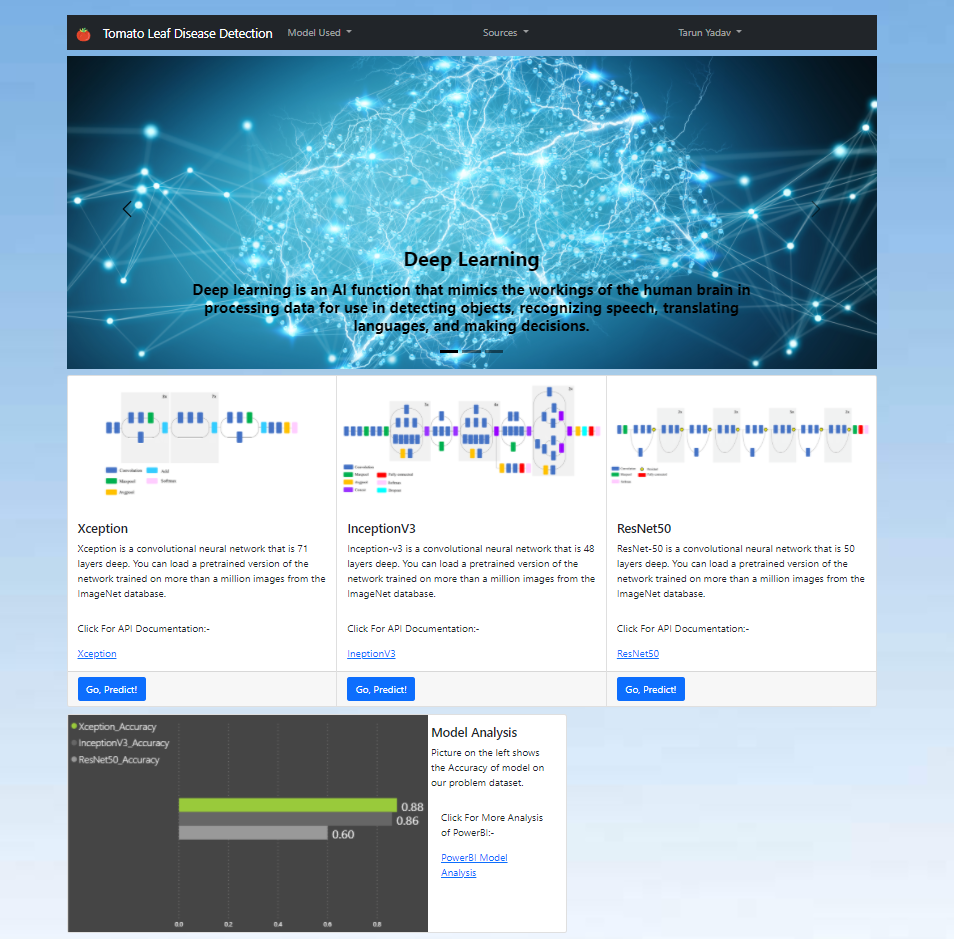

# Tomato Leaf Disease Prediction
---

### Table of Contents
You're sections headers will be used to reference location of destination.

- [Demo](#demo)
- [Overview](#overview)
- [How To Use](#how-to-use)
- [Tool Used](#tool-used)
- [Author Info](#author-info)

---

### Demo




> Above are the pictures of the web site of the Project.

---


## Overview

This is a Flask app for Tomato Leaf Disease Predicton trained on 3 Transfer Learning Model (Pre-Trained Model) available in Keras,
 ie 1. Xception
    2. InceptionV3
    3. ResNet50 
These Models are trained on over 1.2 million picture for the classification of around 1000 categories with million trainable parameters.
Also created a cheatsheet of all 3 models performance and analyse them using Power BI. 

#### Technologies

- Transfer Learning
- Web Development and Deployment (using Flask and Heroku)
- Power Bi (Visualization Tool)

[Back To The Top](#read-me-template)

---

## How To Use

#### Installation

The Code is written in Python 3.7. If you don't have Python installed you can find it [here](https://www.python.org/downloads/). If you are using a lower version of Python you can upgrade using the pip package, ensuring you have the latest version of pip. To install the required packages and libraries, run this command in the project directory after [cloning](https://www.howtogeek.com/451360/how-to-clone-a-github-repository/) the repository:
```bash
pip install -r requirements.txt
```


## References
Keras 
Kaggle
Google
[Back To The Top](#read-me-template)

---

## Tool Used

[](https://keras.io/)  []
[](https://powerbi.microsoft.com/en-us/)

[Back To The Top](#read-me-template)

---


## Author Info

- Twitter - [@taronic777](https://twitter.com/taronic777)
- linkedIn - [Tarun Yadav](https://www.linkedin.com/in/tarun-yadav-47442112b/)

[Back To The Top](#read-me-template)
